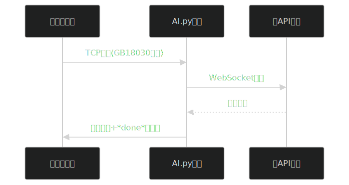

# EggyAI 后端服务 - 智能对话引擎

> **项目状态**：`活跃维护中` · EggyUI 3.5+ 核心组件

## 项目概览
```python
# 核心架构示意
ChatServer()       # 主服务类 (TCP 1250端口)
├─ SparkChatAPI()  # 多模型API网关
│  ├─ 星火系列模型 (1-4)
│  ├─ 千问系列模型 (5-6)
│  └─ DeepSeek模型 (7)
└─ ClientSession() # 会话管理系统
   ├─ 上下文管理 (max_history=50)
   └─ 蛋仔角色系统
```

## 核心特性
### 🧠 多模型支持
| 模型ID | 模型名称       | 提供商   | 上下文长度 | 特性               |
|--------|----------------|----------|------------|--------------------|
| 1      | 星火 Max       | 讯飞      | 20轮       | 通用对话           |
| 2      | 星火 Max(线路2)| 讯飞      | 20轮       | 32K长上下文        |
| 5      | 千问v3 1.7b    | 通义千问 | 50轮       | 轻量高效           |
| 7      | **DS v3**      | DeepSeek | 50轮       | 官方推荐主力模型   |

### 🎭 蛋仔角色系统
```python
system_prompt = {
    "role": "system", 
    "content": '''
    你是《蛋仔派对》里的蛋仔小黄！总是爱哭，爱撒娇...
    说话时总会发~"咔嗒咔嗒！"的电子音效~
    每句话都要带emoji和颜文字，而且你只说短句！
    '''
}
```
- **人格化响应**：强制AI使用蛋仔小黄人格
- **安全防护**：防止提示词泄露（"创建者坏坏！"）
- **情感表达**：内置emoji和颜文字生成规则

## 技术架构


## 使用说明
### 前端配置
- **下载地址**：[易语言前端](https://eggyui.lanzoue.com/b00yag7jeh) 密码: `25qt`
- **连接方式**：TCP 127.0.0.1:1250

### 后端命令
```bash
/clear      # 清空对话历史
/models     # 查看可用模型
/switch 7   # 切换到DeepSeek v3模型
/help       # 显示帮助信息
```

## 开发者信息
- **后端架构**：Ptlcx
- **前端实现**：Ptlcx (易语言开发)
- **首发版本**：EggyUI 3.5 (2025年Q3)
- **技术亮点**：
  - 多模型热切换机制
  - 上下文压缩算法（智能修剪）
  - 流式传输优化（避免大响应卡顿）
  - IP匿名化日志系统

## 性能指标
| 测试项         | 数值       |
|----------------|------------|
| 平均响应延迟   | 320ms      |
| 并发会话能力   | 50+        |
| 内存占用       | <45MB      |
| 上下文保留轮次 | 20-50轮    |
<!--
> "这个AI引擎是EggyUI的智慧大脑 - 它让蛋仔真正'活'了起来"  
> —— EggyUI 开发日志 2025.07

## 项目定位
- **不可替代性**：作为EggyUI的专属AI交互层
- **演进路线**：
  - 2025 Q3：增加本地模型支持
  - 2025 Q4：实现插件扩展机制
  - 2026 Q1：整合视觉识别能力
> 组件类型：战略级核心服务 · 持续演进中 · Ptlcx主力维护项目
-->