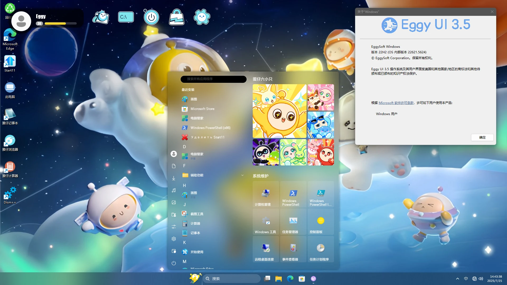

# EggyUI

[简体中文](README.md) | **English**

If you find GitHub access slow in China, you can check out its Gitee page: [https://gitee.com/system-light/EggyUI/tree/master/](https://gitee.com/system-light/EggyUI/tree/master/)

## 🎮 Project Introduction
EggyUI is a customization theme pack designed exclusively for Windows desktop.

> ⚠️ Important Notes
> 1.  It only works on Windows desktop; mobile or other operating systems are not supported.
> 2.  This project is inspired by "Eggy Party" and is a fan-made derivative work. Commercial use is strictly prohibited.
> 3.  Monetization is not allowed—this includes paid distribution, bundling with commercial software, ad-based revenue, or inclusion in paid services.
> 4.  Regarding asset sources:
>     *   No decompiled/game asset files from "Eggy Party" were used.
>     *   All visual elements are sourced legitimately (e.g., in-game screenshots, official promotional images).
>     *   Similar-looking elements were redrawn from scratch to emulate the game’s UI style.
> 5.  Trademarks and attribution:
>     *   This project is unrelated to Microsoft Corporation—it is an independently developed third-party theme customization pack.
>     *   Windows® is a registered trademark of Microsoft in the U.S. and other countries. We modify the Windows interface visually and do not represent Microsoft’s official views or products.

## 🌟 About EggyUI
*   Nature: Non-profit fan creation (essentially a Windows desktop customization pack).
*   Developer: Created by [BSOD-MEMZ](https://github.com/BSOD-MEMZ) (Bilibili: [https://space.bilibili.com/1975308950](https://space.bilibili.com/1975308950)) and their team.
*   Scope: A feature-rich Windows desktop personalization theme pack.
*   Copyright & Trademarks:
    *   Based on NetEase’s "Eggy Party" UI style; original game assets belong to NetEase.
    *   Assets are either self-remade or legally sourced—no game decompilation materials.
    *   Windows® and related trademarks (names/logos) are property of Microsoft. EggyUI has no affiliation, sponsorship, or endorsement from Microsoft. It aims to offer a personalized visual experience.

## ✨ EggyUI Development Journey

*   Origins & Early Versions:
    *   The project began in April 2024. Developer BSOD-MEMZ was creating an "Eggy Party"-style Shell UI for a Windows PE maintenance system ("EggyOS"). Though unpublished, it became EggyUI’s foundation.
    *   On July 22, 2024, BSOD-MEMZ released EggyUI 1.0 (Win11-only). Later, [Win-Fluent-GPT](https://space.bilibili.com/1326423111) developed a Win10 version (no image released; continued by MEMZ-Edge).
    *   EggyUI 2.0 (August 8, 2024) debuted as a standalone installer but faced criticism for complex setup. Version 2.5 (January 25, 2025) added acrylic effects and optimized Rainmeter components.

*   3.0 Setbacks & Community Efforts:
    *   On March 15, 2025, EggyUI 3.0 was announced but canceled after the dev team’s chat group disbanded unexpectedly, resulting in file loss.
    *   Community member [SYSTEM-LIGHT](https://space.bilibili.com/1591761987) quickly created a system image, released for testing on April 20, 2025.
    *   On May 6, 2025, EggyUI’s official account announced a "temporary disbandment" (written by member [ShenBuGaoWoGao](https://space.bilibili.com/3546785651887055)). Most developers (including BSOD-MEMZ) opposed this, and development continued.
    *   On May 31, 2025, a major update replaced EasyLanguage-built components with .NET equivalents (to reduce antivirus false positives). This became the first stable .NET-integrated version and laid groundwork for 3.5.

*   Fleeting Appearance of the Eggy Desktop Pet:
    *   EggyUI 3.0 included an "Eggy Desktop Pet" (Python-based, by Sylphy and Red.Blue.Light). It aimed to be a DeepSeek AI-powered assistant with command execution via Function Calling.
    *   Removed in 3.5 due to:
        *   Loss of AI functionality and Sylphy’s departure.
        *   Closed-source code (only Red.Blue.Light had access; API key security concerns).
        *   High maintenance costs. Despite discontinuation, it was an innovative experiment.

*   Unrealized Concepts: GloPM & Font Strategy:
    *   GloPM (by Sylphy) aimed to be a resource-sharing hub for EggyUI. It was scrapped due to maintenance risks (single-person dependency), complexity, and security review challenges.
    *   Font strategy learned from past issues (EggyUI 2.0 for Win7 caused compatibility problems by replacing system fonts). Now, EggyUI preserves default fonts (e.g., Microsoft YaHei) and uses "Eggy"-style fonts (FZLanTingYuan) only in specific areas (e.g., Start11), balancing aesthetics and stability.

## ⚙️ Major Innovations in EggyUI 3.5

*   Basics:
    *   Free for non-commercial/personal use only.
    *   All assets are compliant; UI elements are remade based on official materials.

*   Technical Upgrades:
    *   Core components partially rewritten in .NET (replacing EasyLanguage), yielding:
        *   Better system compatibility.
        *   >40% performance boost and faster responsiveness.
        *   Improved security, stability, and maintainability.
        *   Reduced memory leak risks.

*   Installation Overhaul:
    *   New Windows system installation + unattended automated deployment.
    *   Demo video: [Eggy Party-Style Custom Win11 — Eggy UI 3.5 Experience](https://www.bilibili.com/video/BV1kbgGz7Em1).
    *   Physical device demo by [0xc0000022](https://space.bilibili.com/1092500907): [Eggy UI 3.5 Real-Machine Unboxing](https://www.bilibili.com/video/BV13w8nzqE4V).

*   Release Notes & Clarifications:
    *   "Image leak" rumors were false; caused by internal miscommunication.
    *   Actual release timeline:
        *   Review video: July 21, 2025 (near 1st anniversary).
        *   Image release: July 22, 2025 (anniversary date).
    *   Compatibility:
        *   System modifications rigorously tested.
        *   Rare issues may occur (e.g., system drive letter `X:`).
        *   Start menu glitches (uncommon) are being addressed via user feedback.

*   Recommendations:
    *   ⚠️ Strongly advised: Use this theme on clean, official Windows installations.
    *   💡 A safer standalone installer (non-system-modifying) is in development.
    *   Current system image carries higher risks than typical desktop customization.

*   Breakthroughs:
    *   Fixed legacy compatibility issues (e.g., network configuration errors).
    *   Significant component performance improvements.

## 💡 Conclusion
> ⚠️ Reiterated: Prioritize installing customization components via standard methods on clean Windows systems. Pre-themed system images may carry stability risks. The standalone EggyUI 3.5 installer for official Windows is underway—stay tuned.

EggyUI is a non-commercial, fan-made Windows desktop customization pack. Version 3.5 adopts a new system-level deployment and .NET-rewritten components, greatly improving compatibility and stability.

Key Reaffirmations:
🔒 This is an "Eggy Party" fan creation:
*   Permanently free; commercial use forbidden.
*   Uses no decompiled game assets—only remade/legitimate materials.
*   Commercialization violates the license.

🔒 Legal & Trademarks:
*   EggyUI is unrelated to Microsoft.
*   Windows® is a registered trademark of Microsoft.
*   This is an unofficial visual modification for personalized experiences, not a Microsoft product.

